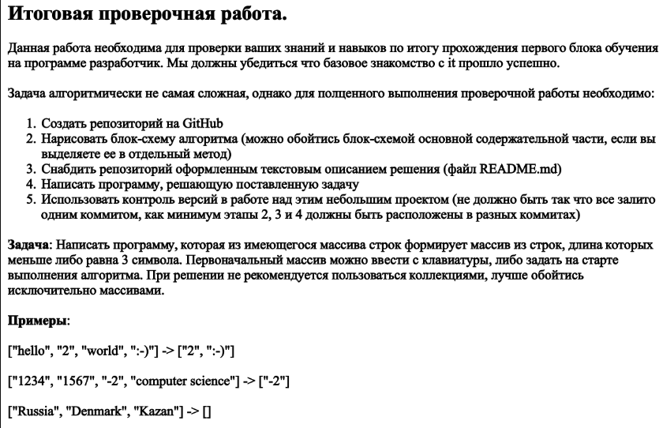
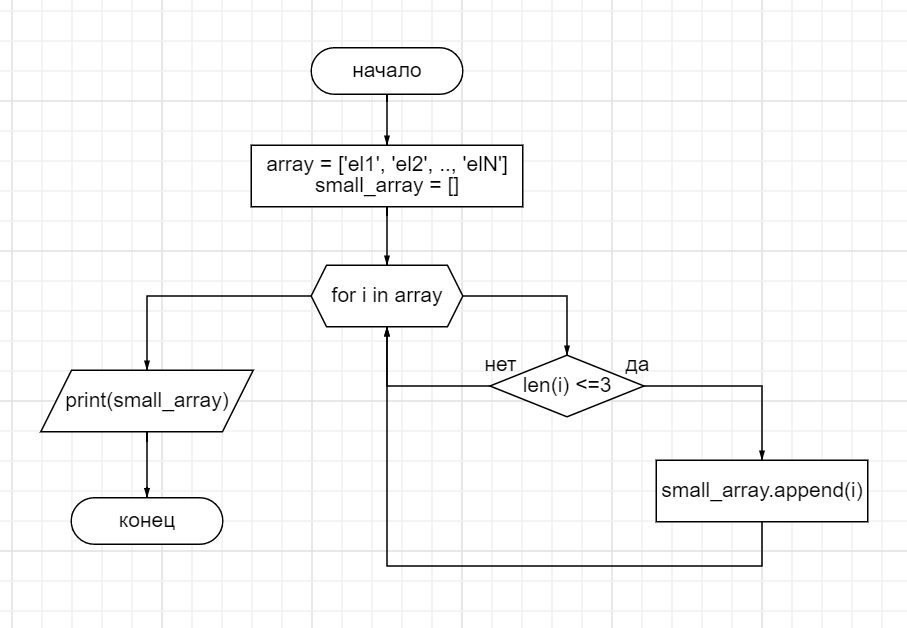

# Итоговая проверочная работа.

## Задание:


## Решение:

### Блок-Схема:
*На данной блок схеме отображена сама суть задания. В неё не вошёл запрос массива от пользователя.*<br>


### Код:
*Так как в задании не был указан язык программирования, на котором требуется осуществить задачу, я выбрал язык Python:*
```python
def get_small_array(array):
    small_array = []
    for i in array:
        if len(i) <= 3:
            small_array.append(i)
    return small_array

print("Программа принимает массив из строк\
     и воводит массив из тех строк, у которых длинна <= 3 символа")
print("Зададим массив..")
array = []
count = 1
while 1:
    i = input(f'Введите элемент № {count}. Для окончания ввода нажмите "q": ')
    if i == 'q':
        break
    else:
        array.append(i)
    count +=1

print(get_small_array(array))
```
